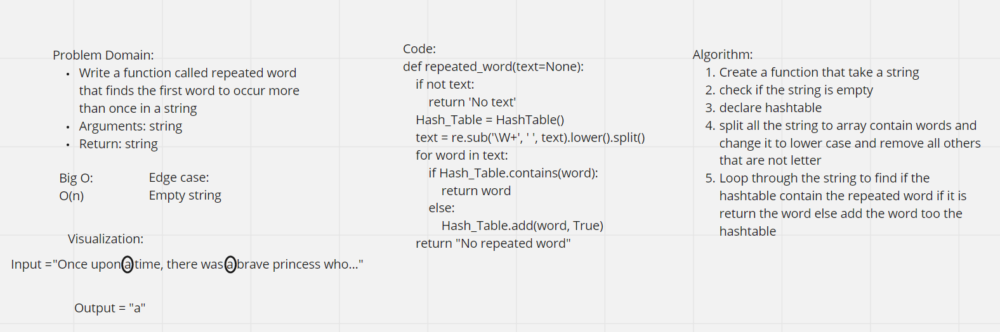

# Challenge Summary

-   Write a function called repeated word that finds the first word to occur more than once in a string

Arguments: string

Return: string

## Whiteboard Process



## Approach & Efficiency

Create a function that takes a string the check if the string is empty, after that declare hashtable that is equal to the hashtable class. Then split all the string to array contain words and change it to lower case and remove all others that are not letter, finally loop through the string to find if the hashtable contain the repeated word if it is return the word else add the word to the hashtable.

Big O: O(n)

## Solution

```
def repeated_word(text=None):
    if not text:
        return 'No text'
    Hash_Table = HashTable()
    text = re.sub('\W+', ' ', text).lower().split()
    for word in text:
        if Hash_Table.contains(word):
            return word
        else:
            Hash_Table.add(word, True)
    return "No repeated word"

```

## Pull Request

https://github.com/Faisal-Kushha/data-structures-and-algorithms/pull/40

Faisal Kushha
