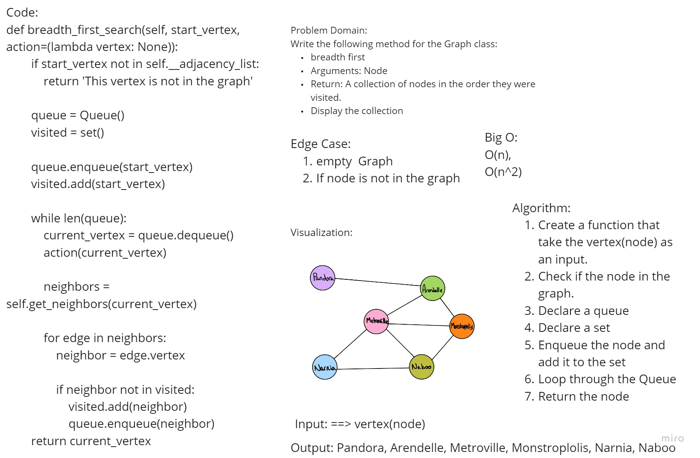

# Challenge Summary

Write the following method for the Graph class:

-   breadth first
-   Arguments: Node
-   Return: A collection of nodes in the order they were visited.
-   Display the collection

## Whiteboard Process



## Approach & Efficiency

Create a function that take the vertex(node) as an input. Check if the node in the graph. Declare a queue Declare a set Enqueue the node and add it to the set Loop through the Queue Return the node

Big O: O(n), O(n^2).

## Solution

```
def breadth_first_search(self, start_vertex, action=(lambda vertex: None)):
        if start_vertex not in self.__adjacency_list:
            return 'This vertex is not in the graph'

        queue = Queue()
        visited = set()

        queue.enqueue(start_vertex)
        visited.add(start_vertex)

        while len(queue):
            current_vertex = queue.dequeue()
            action(current_vertex)

            neighbors = self.get_neighbors(current_vertex)

            for edge in neighbors:
                neighbor = edge.vertex

                if neighbor not in visited:
                    visited.add(neighbor)
                    queue.enqueue(neighbor)
        return current_vertex
```

## Pull Request

https://github.com/Faisal-Kushha/data-structures-and-algorithms/pull/44
