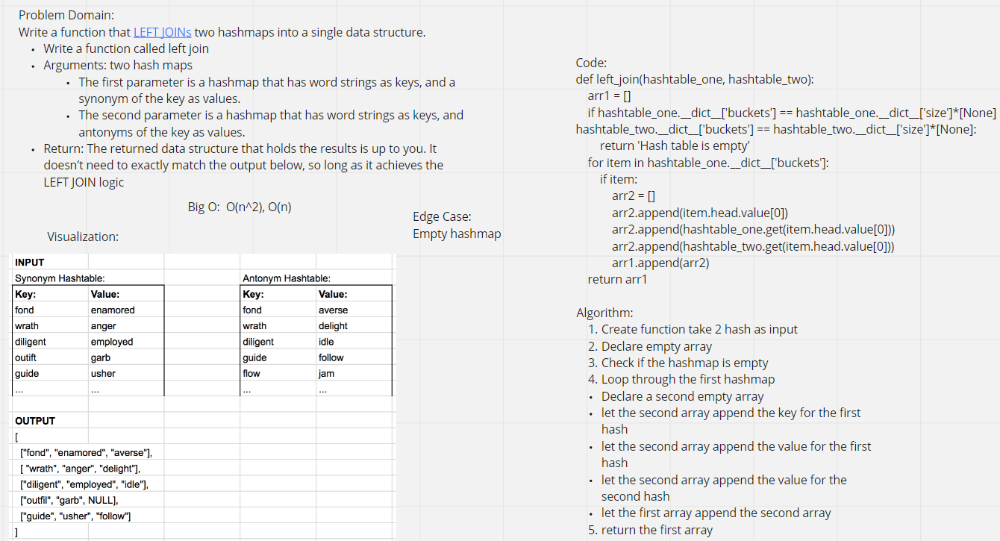

# Challenge Summary

-   Write a function that LEFT JOINs two hashmaps into a single data structure.

-   Write a function called left join

-[x] Arguments: two hash maps

-   The first parameter is a hashmap that has word strings as keys, and a synonym of the key as values.

-   The second parameter is a hashmap that has word strings as keys, and antonyms of the key as values.

-[x] Return: The returned data structure that holds the results is up to you. It doesn’t need to exactly match the output below, so long as it achieves the LEFT JOIN logic

## Whiteboard Process



## Approach & Efficiency

Create a function that take 2 hashmaps as input, then declare an empty array and check if the hashmap is empty. Loop through the first hashmap, then declare a second empty array and append the key for the first hash then append the value for the first hash after that append the value for the second hash. finally let the first array append the second array and return it.

Big O: O(n^2), O(n)

## Solution

```
def left_join(hashtable_one, hashtable_two):
    arr1 = []
    if hashtable_one.__dict__['buckets'] == hashtable_one.__dict__['size']*[None] or hashtable_two.__dict__['buckets'] == hashtable_two.__dict__['size']*[None]:
        return 'Hash table is empty'
    for item in hashtable_one.__dict__['buckets']:
        if item:
            arr2 = []
            arr2.append(item.head.value[0])
            arr2.append(hashtable_one.get(item.head.value[0]))
            arr2.append(hashtable_two.get(item.head.value[0]))
            arr1.append(arr2)
    return arr1


```

## Pull Request

https://github.com/Faisal-Kushha/data-structures-and-algorithms/pull/42
